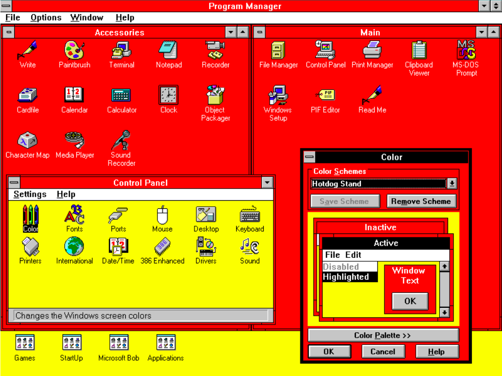

# HotDogStand

## Description 
This is a CSS Framework that is a tribute to Windows 3.1's Hot Dog Stand Color Scheme

Here is how the [Window's 3.1](https://en.wikipedia.org/wiki/Windows_3.1x "Wikipedia for Window's 3.1")'s Hot Dog Stand Color Scheme looked in as it was released on April 6, 1992

HotDogThemebyWindows3.1.png


### Live
Here's how this framework looks

## Getting Started

These instructions will get you a copy of the project up and running on your local machine.


```
1. Clone or download the project onto your local machine.
2. Navigate to the cloned directory on your local machine.
3. Run "npm install" to install the necessary dependencies. 
4. Run "npm run dev" to start running the development server.
```


## License

This project is licensed under the MIT License - see the [LICENSE.md](LICENSE.md) file for details
